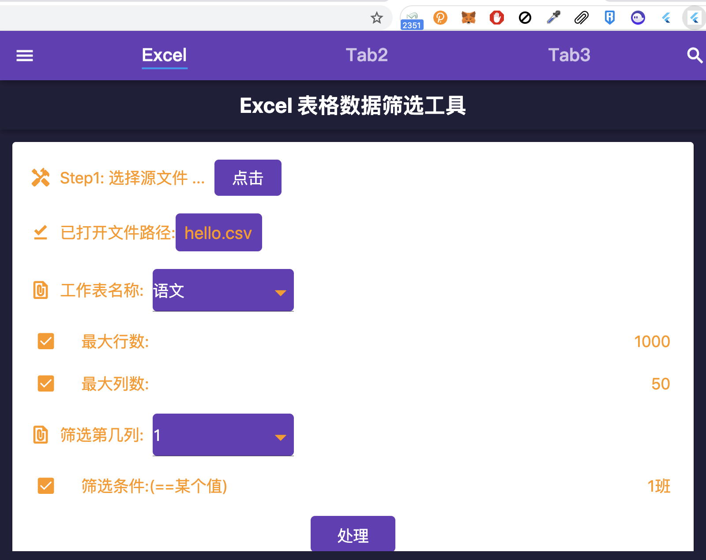

# toolbox

A new Flutter project.

- web 版的小工具箱.

## 功能: 

- Excel 表格处理


## 在线访问: 

- 浏览器打开: https://better-dart.github.io/toolbox/
- 支持手机访问 H5 页面

> 预览效果: 


## 开发:

### 开发环境: 

- flutter: 2.5.3+
- GetX


> run: 


```bash

# install:
task init


# run:
task run:web

```

- 本地浏览器访问


## 部署: 

### 发布到 github pages:

- 本项目已配置了 github action, 
- 当 main 分支有提交, 会自动hook 到 github action,
- 触发 flutter build 动作, 并自动将编译后的 web 资源发布 gh-pages 分支.
- 之后就可以访问: https://better-dart.github.io/toolbox/

### 本地发布:

- 编译:

```bash

task release:web

```

- 编译结果: build/web 下

### 发布 chrome 插件:

- 编译:

```bash

task release:chrome

```

- 浏览器, 打开插件, 加载本地插件:


- 插件效果:



